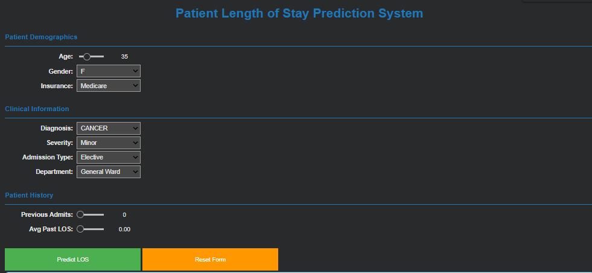
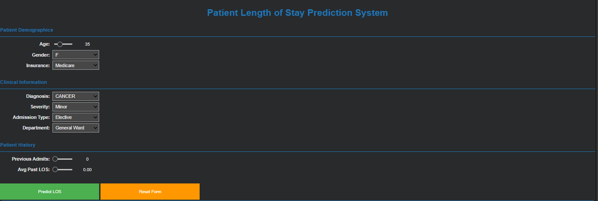

# Healthcare Analytics Projects – Combined README

This repository documents the work completed across **two healthcare analytics solutions**, strictly based on the implemented tasks, analyses, and models discussed in the recent project conversations.

## 🛠️ Tech Stack

  
  
  
  
  
  
  
  
  
  
  
  

## Projects covered:

* **Inventory Solution (Pharmacy Inventory Analytics)**

* **Interactive Hospital Diagnostics & Bed Occupancy Solution**
 
* **Predict Length Of Stay to avoid discharge delays and optimise bed occupency:**

---

## 1. Pharmacy Inventory Solution

### Objective

* Analyze medicine sales and inventory data
* Identify stock movement patterns and reorder risks
* Support inventory optimization through analytical insights

### Scope of Work Performed

* Loaded and structured sales and inventory CSV data into MySQL
* Created structured tables for `med_sales` and inventory datasets
* Analyzed daily and category-level sales trends
* Identified fast-moving and slow-moving drugs
* Performed ABC / FBC-style categorization for inventory prioritization
* Grouped analysis by **active ingredient**, not just drug name
* Designed **reorder trigger heatmaps** to flag low-stock risk
* Handled stock status logic including low stock, healthy stock, and expired stock

### Data Used

* **Pharma Sales & Inventory Dataset (Kaggle)**
  Source: Kaggle – Pharma Sales Data by Milan Zdravkovic
  Dataset used for analyzing medicine sales, revenue contribution, stock movement, and inventory prioritization.  
  https://www.kaggle.com/datasets/milanzdravkovic/pharma-sales-data :contentReference[oaicite:0]{index=0}

  Key components leveraged:

  * Drug and product identifiers
  * Sales quantity and revenue metrics
  * Time-based sales records

* **Hospital Inpatient Discharges Dataset (SPARCS, New York State)**
  Source: New York State Department of Health – SPARCS De-Identified Inpatient Discharges
  Dataset used for hospital diagnostics, LOS analysis, and bed occupancy modeling.  
  https://health.data.ny.gov/Health/Hospital-Inpatient-Discharges-SPARCS-De-Identified/u4ud-w55t/about_data :contentReference[oaicite:1]{index=1}

  Key components leveraged:

  * Admission and discharge information
  * Diagnosis and procedure categories
  * Patient-level structured records (de-identified)

### Tools & Technologies Used

* Python (Pandas)
* MySQL (table creation & querying)
* Power BI (DAX calculations, heatmaps, dashboards)
* Jupyter Notebook

### Key Insights Generated

* High-revenue drugs formed a small subset of total inventory (Category A)
* Certain active ingredients showed consistently high demand
* Heatmap-based reorder triggers helped visualize stock-out risks
* Expiry-aware stock classification reduced inventory blind spots

---

## 2. Interactive Hospital Diagnostics & Bed Occupancy Solution

### Objective

* Analyze hospital admission and discharge delays
* Identify diagnosis categories contributing to prolonged Length of Stay (LOS)
* Build predictive models to support bed occupancy planning

### Scope of Work Performed

* Conducted diagnosis-wise delay analysis
* Compared administrative vs social admission delays
* Identified **diagnosis categories causing the longest LOS delays**
* Built visual insights to explain discharge bottlenecks
* Developed an interactive diagnostics approach for hospital decision-making

### Healthcare Problem Areas Identified

* Discharge delays linked to administrative and social admission factors
* Neonate cases with major procedures showing extended LOS
* Bed turnover inefficiencies impacting emergency admissions

### Machine Learning & Model Work

* Performed feature engineering on structured hospital data
* Trained an **enhanced machine learning model** for LOS prediction
* Used only features present in the enhanced dataset during training
* Validated that model accuracy depended on engineered features, not variable naming
* Debugged and resolved model training and data-passing issues

### Model Explanation (High Level)

* Input: Structured patient, diagnosis, and admission features
* Process: Feature selection → model training → prediction
* Output: Predicted Length of Stay to support bed availability planning

### Tools & Technologies Used

* Python (Pandas, NumPy)
* Jupyter Notebook
* Machine Learning (Gradient Boosting–based regression)
* Matplotlib / Seaborn for diagnostic visuals

---

## Structural Data Handling

Across both projects:

* Worked with **structured datasets** only
* Created clean schemas for sales, inventory, and hospital records
* Ensured feature consistency between data preparation and model training
* Handled data errors and edge cases during analysis and modeling

---

## Key Skills Demonstrated

* Healthcare domain problem understanding
* Structured data modeling and validation
* Exploratory and diagnostic analytics
* Inventory optimization logic
* Machine learning model reasoning and debugging
* Insight-driven visualization

---

## Intended Use

This repository is suitable for:

* Data Analyst / Healthcare Analytics portfolios
* Internship and entry-level ML role evaluations
* Case study discussions during interviews

---

## Author

**Shalini**
Data Analyst | Healthcare Analytics | Python | SQL | Power BI
